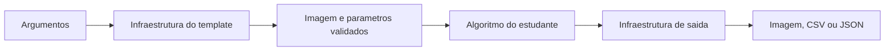
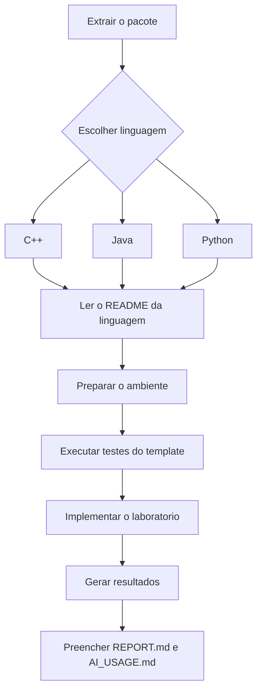

# Projetos-base — Laboratórios M1 — PDI 2026-02

Este pacote contém três projetos-base equivalentes para os laboratórios individuais da M1:

- `cpp/` — C++20 + CMake + OpenCV;
- `java/` — Java 17+ + Maven + OpenPnP OpenCV;
- `python/` — Python 3.10+ + `venv` + OpenCV headless + pytest.

As três versões preservam o mesmo contrato externo de execução. A linguagem muda; o que será solicitado e avaliado permanece equivalente.

## O que este projeto-base resolve para você

A intenção é permitir que você concentre o trabalho nos algoritmos de Processamento de Imagens. A infraestrutura geral será fornecida e documentada: organização do projeto, construção, execução em terminal, leitura de parâmetros, entrada e saída de arquivos, tratamento dos principais erros e testes da própria infraestrutura.

As operações avaliadas continuam sem implementação. Você deverá escrever o percurso dos pixels ou vizinhanças, os cálculos, o tratamento numérico pertinente ao algoritmo e os testes específicos solicitados no roteiro.



## Escolha apenas uma linguagem

Você não precisa desenvolver o mesmo laboratório três vezes. Escolha uma das pastas e trabalhe somente nela.



## Contrato comum de execução

Forma geral:

```bash
pdi_lab \
  --input <arquivo> \
  --output <arquivo-ou-diretorio> \
  --operation <operacao> \
  [opcoes]
```

Parâmetros previstos no contrato da M1:

- `--value`;
- `--levels`;
- `--threshold`;
- `--alpha`;
- `--kernel`;
- `--border`.

As operações obrigatórias são as mesmas nas três linguagens:

### M1.1

`inspect`, `copy`, `channel_b`, `channel_g`, `channel_r`, `grayscale_average`, `grayscale_weighted`, `quantize`.

### M1.2

`brightness`, `contrast`, `negative`, `threshold`, `histogram`.

### M1.3

`convolution`, `mean_filter`, `weighted_mean`, `laplacian`, `sobel`.

## Estrutura comum

Cada implementação possui, com pequenas diferenças próprias da linguagem:

```text
README.md
REPORT.md
AI_USAGE.md
lab.json
images/
├── input/
└── output/
kernels/
results/
tests/
codigo-fonte/
arquivo-de-construcao-ou-dependencias
```

## O que deve permanecer equivalente entre as linguagens

- nomes das operações;
- parâmetros da linha de comando;
- formatos das imagens e kernels fornecidos;
- formato CSV e JSON produzido pela infraestrutura;
- códigos de saída;
- comportamento das validações gerais;
- conjunto de imagens-base;
- testes públicos equivalentes.

A estrutura interna não precisa ser artificialmente idêntica: C++, Java e Python seguem convenções próprias.

## Documentação comum

Leia também a pasta `docs/`:

- `00-padrao-comum-das-tres-linguagens.md` — o que deve ser equivalente;
- `01-como-usar-o-template.md` — sequência recomendada de trabalho;
- `02-interface-cli.md` — contrato da interface de linha de comando.

Depois consulte o `README.md` da linguagem escolhida para os comandos de construção, instalação, teste e execução.
