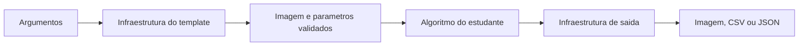
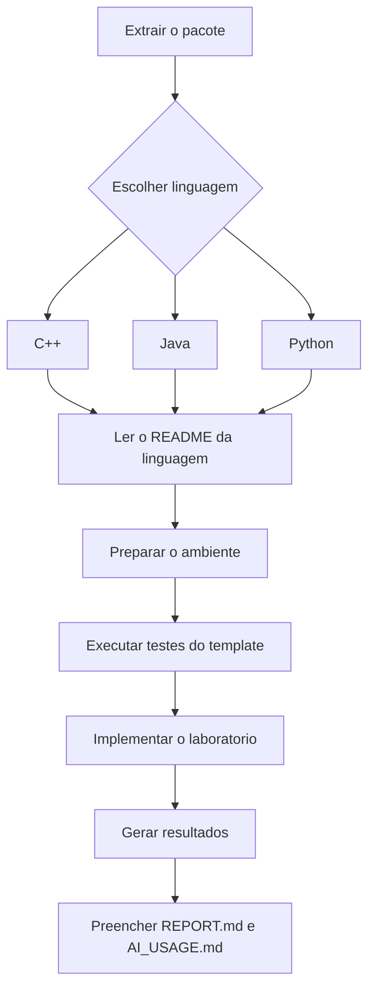

# Projetos-base — Laboratórios M1 — PDI 2026-02

Este pacote contém três projetos-base equivalentes para os laboratórios individuais da M1:

- `cpp/` — C++20 + CMake + OpenCV;
- `java/` — Java 17+ + Maven + OpenPnP OpenCV;
- `python/` — Python 3.10+ + `venv` + OpenCV headless + pytest.

Versão do projeto-base: **0.2.0**. Versão do contrato externo: **2**.

As três versões preservam o mesmo contrato externo de execução. A linguagem muda; o que será solicitado e avaliado permanece equivalente.

## O objetivo do template

A intenção é permitir que você concentre seu tempo nos algoritmos de Processamento de Imagens. A infraestrutura geral já cuida de:

- organização do projeto;
- construção ou instalação;
- execução em terminal;
- leitura e validação de parâmetros;
- leitura e escrita de imagens;
- criação de diretórios de saída;
- leitura e validação estrutural de kernels;
- escrita de CSV;
- escrita de JSON;
- mensagens e códigos de erro da infraestrutura;
- testes públicos da própria base.

As operações avaliadas continuam sem implementação. Você deverá escrever o percurso dos pixels ou vizinhanças, os cálculos, o tratamento numérico pertinente ao algoritmo e os testes específicos solicitados no roteiro.



## Escolha apenas uma linguagem

Você não precisa desenvolver o mesmo laboratório três vezes. Escolha uma das pastas e trabalhe somente nela.



## Contrato comum de execução

Forma geral:

```text
pdi_lab --operation <operacao> --input <arquivo> --output <arquivo> [parametros]
```

`inspect` é a única operação que não exige `--output`.

Parâmetros previstos no contrato da M1:

- `--value` — valor inteiro usado por brilho;
- `--levels` — `2`, `4`, `8` ou `16`;
- `--threshold` — inteiro entre `0` e `255`;
- `--alpha` — fator real positivo;
- `--kernel` — caminho de um kernel textual;
- `--border` — `copy` ou `replicate`;
- `--size` — `3` ou `5` para `mean_filter`.

A validação desses valores é fornecida pelo projeto-base. O estudante não precisa escrever parsing de strings para cada algoritmo.

## Operações obrigatórias

### M1.1 — representação, canais e níveis de cinza

`inspect`, `copy`, `channel_b`, `channel_g`, `channel_r`, `grayscale_average`, `grayscale_weighted`, `quantize`.

### M1.2 — transformações de intensidade

`brightness`, `contrast`, `negative`, `threshold`, `histogram`.

### M1.3 — convolução e filtragem espacial

`convolution`, `mean_filter`, `weighted_mean`, `laplacian`, `sobel`.

As atividades complementares dos roteiros não são transformadas em requisitos adicionais do contrato mínimo.

## Estrutura comum

Cada implementação possui, com pequenas diferenças próprias da linguagem:

```text
README.md
REPORT.md
AI_USAGE.md
lab.json
images/
├── input/
└── output/
kernels/
results/
tests/
codigo-fonte/
arquivo-de-construcao-ou-dependencias
```

## O que deve permanecer equivalente entre as linguagens

- nomes das operações;
- nomes e significado dos parâmetros;
- valores considerados válidos;
- formatos das imagens e kernels fornecidos;
- formato CSV e JSON produzido pela infraestrutura;
- códigos de saída;
- comportamento das validações gerais;
- conjunto de imagens-base;
- finalidade dos testes públicos.

A estrutura interna não precisa ser artificialmente idêntica: C++, Java e Python seguem convenções próprias.

## Antes de implementar o laboratório

1. leia o `README.md` da linguagem escolhida;
2. prepare o ambiente;
3. construa ou instale o projeto;
4. execute os testes públicos;
5. execute `--help` e `--version`;
6. somente depois comece a alterar as operações do laboratório.

Se a base recém-extraída não passa nos testes públicos, investigue o ambiente antes de modificar os algoritmos.

## Documentação comum

A pasta `docs/` complementa os READMEs:

- `00-padrao-comum-das-tres-linguagens.md` — o que deve ser equivalente;
- `01-como-usar-o-template.md` — sequência recomendada de trabalho;
- `02-interface-cli.md` — contrato da linha de comando;
- `03-validacao-manual.md` — verificações manuais de apoio;
- `04-entrada-saida-e-kernels.md` — imagens, CSV, JSON e kernels;
- `05-testes-publicos.md` — diferença entre testar infraestrutura e algoritmo;
- `06-erros-e-codigos-de-saida.md` — categorias padronizadas de erro e códigos de saída.

Depois consulte o `README.md` da linguagem escolhida para os comandos específicos de construção, instalação, teste e execução.

## Licença e citação

Este projeto-base é disponibilizado sob a **Apache License 2.0**. Consulte `LICENSE` para o texto integral da licença.

Os metadados acadêmicos e de software estão em `CITATION.cff`. Se o projeto-base for citado em relatório, artigo, material didático ou trabalho derivado, utilize preferencialmente os dados registrados nesse arquivo.

As bibliotecas e ferramentas de terceiros utilizadas pelo projeto mantêm suas próprias licenças e condições de distribuição.