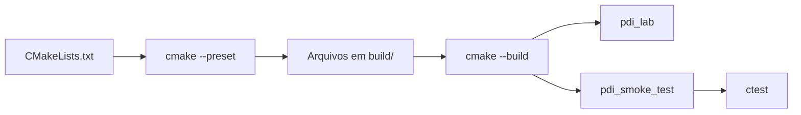

# Projeto-base C++ — Laboratórios M1

Esta variante utiliza C++20, CMake, Ninja e OpenCV. O objetivo do projeto-base é deixar pronta a infraestrutura geral e permitir que o estudante concentre seu tempo nos algoritmos solicitados nos roteiros.

As operações avaliadas permanecem como **stubs**: a interface existe, mas o algoritmo ainda não foi implementado.

## 1. O que cada arquivo de construção faz

### `CMakeLists.txt`

É a descrição principal do projeto para o CMake. Ele informa:

- qual versão mínima do CMake será utilizada;
- qual padrão de C++ será adotado;
- quais arquivos compõem a biblioteca `pdi_core`;
- como localizar o OpenCV;
- como construir o executável `pdi_lab`;
- como construir e registrar os testes públicos.

Você normalmente **não precisa alterar esse arquivo para implementar um laboratório**. Se criar novos arquivos `.cpp`, será necessário adicioná-los à lista de fontes correspondente.

### `CMakePresets.json`

Contém configurações prontas de construção. Um *preset* evita repetir várias opções do CMake no terminal.

Os presets fornecidos são:

- `ucrt64-debug` — Windows com MSYS2 UCRT64, modo de depuração;
- `ucrt64-release` — Windows com MSYS2 UCRT64, modo otimizado;
- `unix-debug` — Linux/macOS e outros Unix-like, modo de depuração.

O comando `cmake --preset ...` **configura** o projeto. O comando `cmake --build --preset ...` **compila**. O comando `ctest --preset ...` **executa os testes**.



## 2. Windows — MSYS2 UCRT64

Com OpenCV instalado no ambiente:

```bash
cmake --preset ucrt64-debug
cmake --build --preset ucrt64-debug
ctest --preset ucrt64-debug
./build/ucrt64-debug/pdi_lab.exe --help
./build/ucrt64-debug/pdi_lab.exe --version
```

Se todos os testes públicos passarem antes de você começar a implementar o laboratório, a infraestrutura básica está funcionando.

## 3. OpenCV portátil

Em uma máquina sem permissão para instalar OpenCV no sistema, extraia uma distribuição compatível com o mesmo toolchain UCRT64/GCC em uma pasta do usuário e informe o diretório que contém `OpenCVConfig.cmake`:

```bash
export PDI_OPENCV_DIR="$HOME/pdi-tools/opencv/lib/cmake/opencv4"
cmake --preset ucrt64-debug
```

Ou diretamente:

```bash
cmake --preset ucrt64-debug \
  -DPDI_OPENCV_DIR="$HOME/pdi-tools/opencv/lib/cmake/opencv4"
```

Não misture binários C++ compilados para MSVC com o executável GCC/UCRT64 da disciplina.

## 4. Unix-like

```bash
cmake --preset unix-debug
cmake --build --preset unix-debug
ctest --preset unix-debug
./build/unix-debug/pdi_lab --help
```

O mesmo `PDI_OPENCV_DIR` pode apontar para uma instalação local no diretório do usuário.

## 5. Estrutura do código

```text
include/pdi/       interfaces publicas
src/               implementacoes
src/main.cpp       ponto de entrada do executavel
tests/             testes publicos
images/input/      imagens fornecidas e imagens de teste
images/output/     resultados em imagem
kernels/           kernels textuais
results/           CSV, JSON e outros resultados
```

O fluxo principal é:


## 6. Onde implementar

Comece em `src/operations.cpp`. Você pode criar funções, classes e arquivos adicionais para organizar melhor o código.

Não concentre a solução em `main.cpp`. O `main` existe para coordenar a execução; os algoritmos devem permanecer separados da infraestrutura geral.

## 7. Regra didática principal

A infraestrutura pronta pode cuidar de argumentos, arquivos, mensagens e erros gerais. O código desenvolvido para o laboratório continua responsável pelo conteúdo de Processamento de Imagens: percorrer pixels ou vizinhanças, realizar os cálculos solicitados, tratar corretamente os valores produzidos e gerar resultados coerentes.
