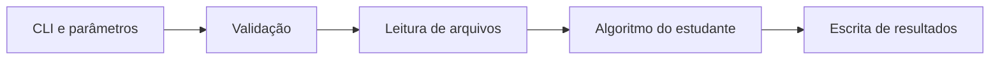

# Padrão comum das três linguagens

As versões C++, Java e Python devem oferecer a mesma experiência externa.

## Mesmo contrato

As três variantes devem preservar:

- os mesmos nomes de operações;
- os mesmos nomes de parâmetros;
- as mesmas regras de obrigatoriedade;
- os mesmos códigos de saída;
- mensagens de erro equivalentes;
- os mesmos formatos de kernel, CSV e JSON;
- a mesma organização de `images/`, `kernels/` e `results/`;
- testes públicos equivalentes.

A implementação interna pode seguir os recursos naturais de cada linguagem.

## Fronteira pedagógica

A infraestrutura fica pronta. O estudante implementa os algoritmos de Processamento de Imagens.

## Parâmetros comuns

`--operation`, `--input`, `--output`, `--value`, `--levels`, `--threshold`, `--alpha`, `--kernel` e `--border`.

## Operações comuns

`inspect`, `copy`, `channel_b`, `channel_g`, `channel_r`, `grayscale_average`, `grayscale_weighted`, `quantize`, `brightness`, `contrast`, `negative`, `threshold`, `histogram`, `convolution`, `mean_filter`, `weighted_mean`, `laplacian` e `sobel`.
