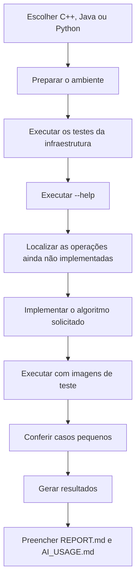

# Como usar o projeto-base

O projeto-base foi preparado para reduzir o trabalho de infraestrutura e permitir que o foco principal permaneça nos algoritmos de Processamento de Imagens.

## Percurso recomendado

## Infraestrutura fornecida

O template deve cuidar de leitura de argumentos, validação geral, leitura e escrita de imagens, diretórios de saída, leitura de kernels, escrita de CSV e JSON, mensagens de erro e testes da infraestrutura.

## Responsabilidade do estudante

O estudante continua responsável pelos algoritmos avaliados: percursos de pixels e vizinhanças, fórmulas, quantização, transformações pontuais, histograma, convolução, bordas, filtros e análise dos resultados.

A infraestrutura não deve substituir essas operações por funções prontas.
