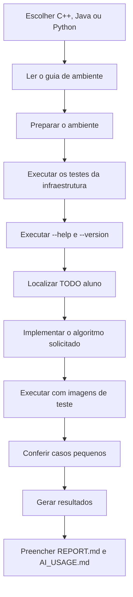

# Como usar o projeto-base

O projeto-base foi preparado para reduzir o trabalho de infraestrutura e permitir que o foco principal permaneça nos algoritmos de Processamento de Imagens.

Antes de alterar código, leia `07-preparacao-do-ambiente-e-erros-comuns.md` e o `README.md` da linguagem escolhida. Se a infraestrutura recém-extraída não construir ou não passar nos testes públicos, resolva primeiro o ambiente.

## Percurso recomendado

## Infraestrutura fornecida

O template cuida de leitura de argumentos, validação geral, leitura e escrita de imagens, diretórios de saída, leitura de kernels, escrita de CSV e JSON, mensagens de erro e testes da infraestrutura.

## Responsabilidade do estudante

O estudante continua responsável pelos algoritmos avaliados: percursos de pixels e vizinhanças, fórmulas, quantização, transformações pontuais, histograma, convolução, bordas, filtros e análise dos resultados.

Nas três variantes, procure por `TODO(aluno)`. Esses comentários indicam os pontos em que a implementação avaliada deve começar. A infraestrutura não deve ser substituída por atalhos que removam o contrato comum, e as operações manuais exigidas no roteiro não devem ser trocadas por funções prontas equivalentes do OpenCV.
