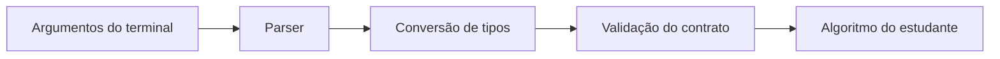

# Interface comum de linha de comando

As versões C++, Java e Python devem aceitar o mesmo conjunto de operações e parâmetros. A forma de execução muda apenas no comando usado para iniciar cada linguagem.

## Forma geral

```text
pdi_lab --operation <operacao> --input <arquivo> --output <arquivo> [parametros]
```

## Parâmetros comuns

- `--operation`: operação solicitada;
- `--input`: arquivo de entrada;
- `--output`: arquivo ou diretório de saída;
- `--value`: valor inteiro, usado quando a operação exigir;
- `--levels`: quantidade de níveis da quantização;
- `--threshold`: limiar;
- `--alpha`: fator em ponto flutuante;
- `--kernel`: caminho para um arquivo de kernel;
- `--border`: estratégia de borda.

A infraestrutura deve converter strings da linha de comando para tipos adequados e rejeitar parâmetros ausentes ou inválidos antes de chamar o algoritmo do estudante.

## Exemplos

```text
--operation quantize --input images/input/test.png --output images/output/q8.png --levels 8
```

```text
--operation brightness --input images/input/test.png --output images/output/brilho.png --value 30
```

```text
--operation threshold --input images/input/test.png --output images/output/binaria.png --threshold 128
```

```text
--operation convolution --input images/input/test.png --output images/output/conv.png --kernel kernels/identity_3x3.txt --border replicate
```

## Separação de responsabilidades



O algoritmo não deve precisar interpretar diretamente strings da linha de comando.
