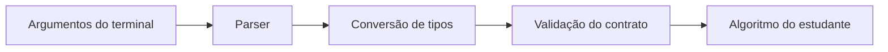

# Interface comum de linha de comando

As versões C++, Java e Python devem aceitar o mesmo conjunto de operações, parâmetros e valores válidos. A forma de iniciar o programa muda conforme a linguagem; o contrato lógico permanece equivalente.

## Forma geral

```text
pdi_lab --operation <operacao> --input <arquivo> --output <arquivo> [parametros]
```

`inspect` é a única operação que não exige `--output`.

## Parâmetros comuns

- `--operation`: operação solicitada;
- `--input`: arquivo de entrada;
- `--output`: arquivo de saída;
- `--value`: valor inteiro usado por `brightness`;
- `--levels`: quantidade de níveis da quantização (`2`, `4`, `8` ou `16`);
- `--threshold`: limiar inteiro entre `0` e `255`;
- `--alpha`: fator real positivo usado por `contrast`;
- `--kernel`: caminho para um arquivo textual de kernel;
- `--border`: estratégia `copy` ou `replicate`;
- `--size`: tamanho `3` ou `5` usado por `mean_filter`.

A infraestrutura converte strings da linha de comando para tipos adequados e rejeita parâmetros ausentes ou inválidos antes de chamar o algoritmo do estudante.

## Regras por operação

| Operação | Parâmetros adicionais obrigatórios |
|---|---|
| `inspect` | nenhum |
| `copy` | nenhum |
| `channel_b`, `channel_g`, `channel_r` | nenhum |
| `grayscale_average`, `grayscale_weighted` | nenhum |
| `quantize` | `--levels` |
| `brightness` | `--value` |
| `contrast` | `--alpha` |
| `negative` | nenhum |
| `threshold` | `--threshold` |
| `histogram` | nenhum |
| `convolution` | `--kernel`, `--border` |
| `mean_filter` | `--size`, `--border` |
| `weighted_mean` | `--border` |
| `laplacian` | `--border` |
| `sobel` | `--border` |

Essa tabela descreve a interface externa. Ela não define como o algoritmo deve ser implementado internamente.

## Exemplos

### Quantização

```text
--operation quantize --input images/input/test.png --output images/output/q8.png --levels 8
```

### Brilho

```text
--operation brightness --input images/input/test.png --output images/output/brilho.png --value 30
```

### Limiarização

```text
--operation threshold --input images/input/test.png --output images/output/binaria.png --threshold 128
```

### Convolução genérica

```text
--operation convolution --input images/input/test.png --output images/output/conv.png --kernel kernels/identity_3x3.txt --border replicate
```

### Filtro de média

```text
--operation mean_filter --input images/input/test.png --output images/output/media.png --size 3 --border copy
```

## Separação de responsabilidades



O algoritmo não deve precisar interpretar diretamente strings da linha de comando.

## Por que a parametrização é fornecida pronta

A parametrização existe para tornar os experimentos reproduzíveis e permitir correção automatizada. Ela não é o conteúdo central dos laboratórios. Por isso, o template cuida do parsing e das guardas gerais, enquanto o estudante concentra seu tempo no processamento da imagem e na análise dos resultados.
