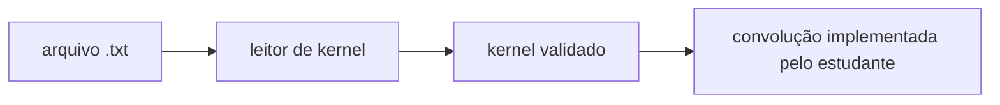

# Entrada, saída, CSV, JSON e kernels

O projeto-base deixa pronta a infraestrutura de arquivos para reduzir trabalho periférico e manter o foco nos algoritmos de Processamento de Imagens.

## Imagens

As três linguagens fornecem funções equivalentes para:

1. abrir uma imagem preservando canais e profundidade;
2. detectar falha de leitura;
3. criar automaticamente diretórios-pai da saída;
4. salvar a imagem;
5. detectar falha de escrita.


O estudante não precisa reimplementar esse fluxo. O trabalho avaliado começa no processamento dos pixels ou das vizinhanças.

## CSV

A infraestrutura oferece uma função específica para serializar um histograma de 256 posições. Ela **não calcula o histograma**.

Responsabilidade do estudante:

```text
imagem -> percurso dos pixels -> vetor de 256 contadores
```

Responsabilidade do template:

```text
vetor de 256 contadores -> arquivo CSV
```

O formato comum é:

```csv
intensity,count
0,12
1,7
2,19
```

## JSON

Também existe uma função para registrar pares chave/valor em JSON. Ela pode ser usada para metadados de experimentos, parâmetros e identificação de resultados.

A serialização é infraestrutura; decidir quais informações são relevantes continua fazendo parte da documentação da execução.

## Kernels

O arquivo de kernel é textual. Linhas vazias e linhas iniciadas por `#` podem ser ignoradas.

Exemplo de kernel identidade 3x3:

```text
0 0 0
0 1 0
0 0 0
```

O leitor fornecido verifica:

- arquivo acessível;
- kernel não vazio;
- linhas com a mesma quantidade de coeficientes;
- kernel quadrado;
- dimensão ímpar;
- coeficientes numéricos válidos.

Depois dessa validação, **aplicar o kernel à imagem continua sendo responsabilidade do estudante**.


