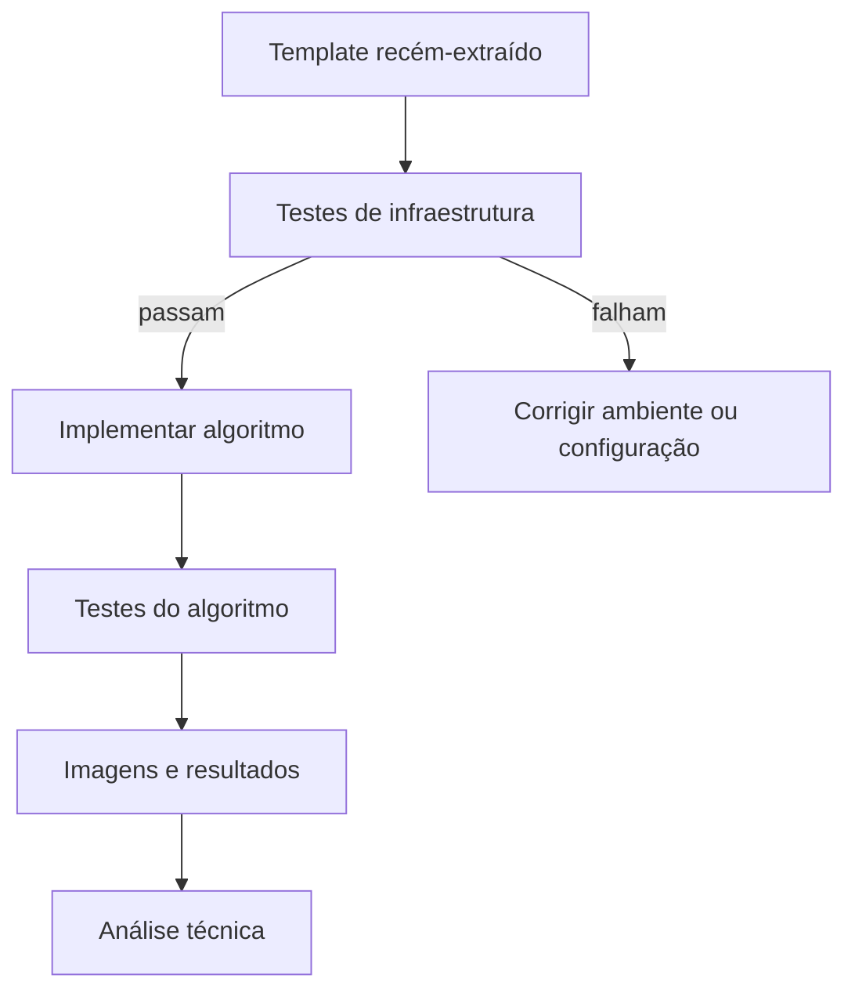

# Testes públicos do projeto-base

Os testes fornecidos têm duas finalidades diferentes.

## 1. Testar a infraestrutura

Antes de implementar qualquer algoritmo, os testes públicos devem confirmar que a base está saudável. Entre outros pontos, eles podem verificar:

- parsing da linha de comando;
- operação conhecida e desconhecida;
- presença de parâmetros obrigatórios;
- conversão de inteiro e ponto flutuante;
- validação de `--levels`, `--threshold`, `--size` e `--border`;
- leitura de kernel válido;
- rejeição de kernel inválido;
- criação de diretório de saída;
- escrita de CSV e JSON.

Se esses testes falharem em uma cópia nova do template, investigue o ambiente antes de começar o laboratório.

## 2. Testar o algoritmo do estudante

Os testes dos algoritmos não serão fornecidos integralmente. Cada roteiro pede imagens pequenas ou sintéticas cujo resultado possa ser previsto ou conferido manualmente.



## Casos pequenos

Exemplos importantes para a M1 incluem:

- imagem colorida 2x2 para canais e níveis de cinza;
- rampa em níveis de cinza para transformações pontuais;
- imagem constante;
- impulso;
- degrau vertical;
- degrau horizontal;
- matriz 5x5 conhecida;
- formas tocando as bordas.

O objetivo de um caso pequeno não é parecer uma fotografia real. Ele deve tornar o comportamento do algoritmo verificável.

## Comandos

### C++

```bash
ctest --preset ucrt64-debug
# ou
ctest --preset unix-debug
```

### Java

```bash
mvn test
```

### Python

```bash
python -m pytest
```

Os três comandos devem ser executados antes e depois das alterações do estudante.
