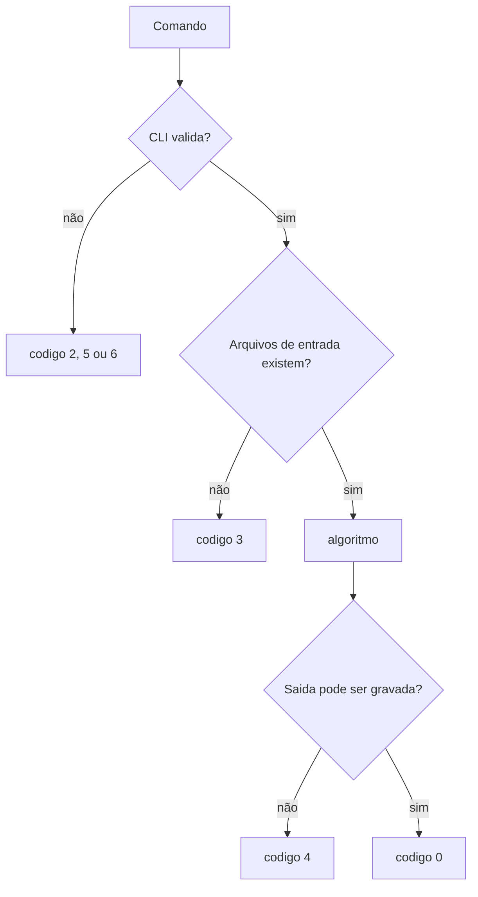

# Erros e códigos de saída

As três linguagens utilizam as mesmas categorias de código de saída. Isso permite que scripts de correção e testes externos interpretem o resultado de forma uniforme.

| Código | Nome lógico | Significado |
|---:|---|---|
| `0` | `success` | execução concluída com sucesso |
| `1` | `general_error` | erro não classificado em outra categoria |
| `2` | `invalid_arguments` | argumento obrigatório ausente ou estrutura da CLI inválida |
| `3` | `read_error` | falha ao localizar ou abrir uma imagem, kernel ou outro arquivo de entrada |
| `4` | `write_error` | falha ao criar diretório ou gravar imagem, CSV ou JSON |
| `5` | `invalid_parameter` | parâmetro presente, porém com valor inválido |
| `6` | `unknown_operation` | nome de operação não reconhecido |

## Exemplo

Um comando como:

```text
--operation threshold --input in.png --output out.png --threshold 300
```

não deve chegar ao algoritmo. O contrato identifica que `300` está fora do intervalo esperado e retorna `invalid_parameter`.

Da mesma forma, a infraestrutura faz uma validação preliminar dos arquivos de entrada. Se a imagem informada não existir ou não for um arquivo regular, a execução retorna `read_error` antes do despacho para o algoritmo. Para a convolução genérica, o mesmo princípio é aplicado ao arquivo informado em `--kernel`.



## O que o estudante precisa fazer

O tratamento da infraestrutura já está pronto. O estudante não precisa espalhar verificações de terminal, caminhos ou serialização por cada algoritmo.

Ainda é responsabilidade do algoritmo detectar condições que pertencem ao conteúdo da operação, como tipo ou número de canais incompatível com uma transformação específica, quando isso não puder ser validado genericamente antes da execução.
