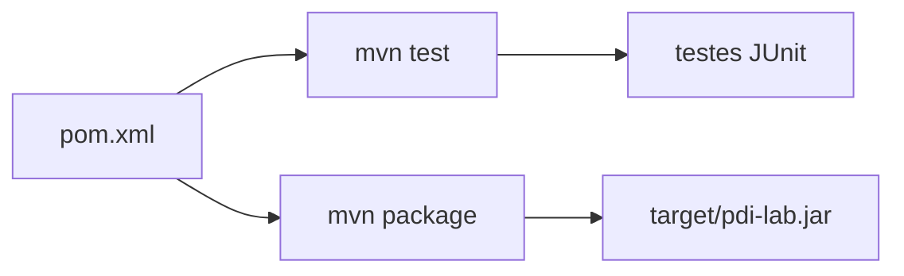

# Projeto-base Java — Laboratórios M1

Esta variante utiliza Java 17+, Maven, JUnit e OpenCV desktop. O projeto-base deixa pronta a infraestrutura geral para que o estudante concentre o trabalho nos algoritmos solicitados nos roteiros.

As operações avaliadas permanecem como **stubs**: a interface existe, mas o algoritmo ainda não foi implementado.

## 1. O que é o `pom.xml`

`pom.xml` significa *Project Object Model*. É o arquivo principal de configuração do Maven. Ele informa:

- identidade e versão do projeto;
- versão do Java utilizada;
- dependências externas;
- framework de testes;
- plugins de compilação e empacotamento;
- classe principal do executável.

Você normalmente não precisa alterar o `pom.xml` para implementar os algoritmos dos laboratórios.



## 2. OpenCV no Java

A dependência `org.openpnp:opencv` é utilizada para uma aplicação Java desktop. Ela disponibiliza os bindings Java e as bibliotecas nativas necessárias em plataformas suportadas.

O carregamento da biblioteca é tratado pela infraestrutura do template. Em condições normais, o estudante não precisa configurar manualmente um caminho para a biblioteca nativa do OpenCV.

## 3. Construção, testes e execução

Desde que `java` e `mvn` estejam disponíveis no `PATH`, os comandos são equivalentes no Windows e em sistemas Unix-like:

```bash
mvn test
mvn package
java -jar target/pdi-lab.jar --help
java -jar target/pdi-lab.jar --version
```

Os comandos têm responsabilidades diferentes:

- `mvn test` — compila o necessário e executa os testes públicos;
- `mvn package` — executa o ciclo de construção e gera o JAR;
- `java -jar ...` — executa a aplicação produzida.

Maven também pode ser utilizado sem instalação administrativa: sua distribuição binária pode ser extraída em uma pasta do usuário e o diretório `bin` adicionado temporariamente ao `PATH`.

## 4. Por que o JAR gerado é executável

O `maven-shade-plugin`, configurado no `pom.xml`, produz o arquivo `target/pdi-lab.jar` e registra `br.univali.pdi.Main` como ponto de entrada.

Isso permite executar diretamente:

```bash
java -jar target/pdi-lab.jar --version
```

## 5. Estrutura do código

```text
src/main/java/br/univali/pdi/   codigo da aplicacao
src/test/java/br/univali/pdi/   testes publicos
images/input/                    imagens fornecidas e imagens de teste
images/output/                   resultados em imagem
kernels/                         kernels textuais
results/                         CSV, JSON e outros resultados
target/                          artefatos gerados pelo Maven
```

O fluxo principal é:


## 6. Onde implementar

Comece em `src/main/java/br/univali/pdi/Operations.java`. Você pode criar classes adicionais para separar responsabilidades e evitar que toda a solução fique em um único arquivo.

Não concentre os algoritmos em `Main.java`. A classe `Main` coordena a execução; as operações de Processamento de Imagens devem permanecer separadas da infraestrutura.

## 7. Regra didática principal

A infraestrutura pronta pode cuidar de argumentos, arquivos, carregamento do OpenCV, mensagens e erros gerais. O código desenvolvido para o laboratório continua responsável pelo conteúdo de Processamento de Imagens: percorrer pixels ou vizinhanças, realizar os cálculos solicitados, tratar corretamente os valores produzidos e gerar resultados coerentes.
