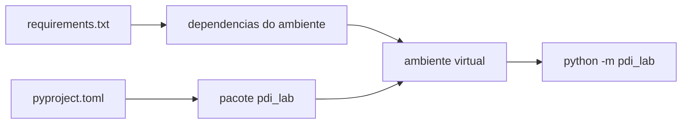

# Projeto-base Python — Laboratórios M1

Esta variante usa Python 3.10+, ambiente virtual (`venv`), OpenCV sem interface gráfica e `pytest`. As operações avaliadas permanecem como **stubs**: a interface existe, mas o algoritmo ainda deve ser implementado pelo estudante.

## 1. Arquivos de construção e dependências

### `requirements.txt`

Lista as dependências do ambiente didático e fixa suas versões para aumentar a reprodutibilidade. Neste template aparecem principalmente:

- `opencv-python-headless` — leitura, escrita e acesso às imagens sem depender de janelas gráficas;
- `pytest` — execução dos testes públicos e dos testes adicionais do estudante.

Instale com:

```bash
python -m pip install -r requirements.txt
```

### `pyproject.toml`

Descreve o pacote Python `pdi-lab`: nome, versão, versão mínima do Python, dependências de execução e localização do código dentro de `src/`.

O comando:

```bash
python -m pip install -e .
```

faz uma instalação **editável**. Assim, alterações em `src/pdi_lab/` passam a ser usadas imediatamente sem reinstalar o pacote a cada edição.



## 2. Criar o ambiente virtual

Na raiz da pasta `python/`:

```bash
python -m venv .venv
```

Windows usando Git Bash ou MSYS2:

```bash
source .venv/Scripts/activate
```

PowerShell:

```powershell
.\.venv\Scripts\Activate.ps1
```

Linux/macOS:

```bash
source .venv/bin/activate
```

Depois instale:

```bash
python -m pip install --upgrade pip
python -m pip install -r requirements.txt
python -m pip install -e .
```

## 3. Testar o projeto-base antes de começar

```bash
python -m pytest
python -m pdi_lab --version
python -m pdi_lab --help
```

Os testes públicos verificam a infraestrutura: CLI, parâmetros, kernels, CSV e JSON. Eles não implementam nem avaliam os algoritmos exigidos nos laboratórios.

## 4. Estrutura principal

```text
src/pdi_lab/
├── __main__.py      ponto de entrada
├── cli.py           leitura dos argumentos
├── contract.py      regras e validações da CLI
├── image_io.py      leitura e escrita de imagens
├── parameters.py    conversão de parâmetros
├── kernel.py        leitura e validação de kernels
├── result_io.py     escrita de CSV e JSON
└── operations.py    ponto inicial das operações avaliadas

tests/               testes públicos
images/input/        imagens-base
images/output/       resultados em imagem
kernels/             kernels textuais
results/             CSV, JSON e outros resultados
```

## 5. Onde implementar

Comece em `src/pdi_lab/operations.py` e crie módulos adicionais quando isso tornar o código mais claro.

A infraestrutura já cuida de:

- argumentos de linha de comando;
- conversão e validação dos parâmetros básicos;
- leitura e escrita de imagens;
- criação dos diretórios de saída;
- leitura e validação estrutural de kernels;
- escrita de histogramas já calculados em CSV;
- escrita de metadados em JSON;
- tratamento dos principais erros de infraestrutura.

O estudante continua responsável por:

- percorrer pixels ou vizinhanças;
- implementar as fórmulas solicitadas;
- calcular histogramas;
- implementar convolução, tratamento matemático de bordas e filtros;
- controlar saturação e tipos numéricos quando fizer parte do algoritmo;
- testar e analisar os resultados.

## 6. Exemplos de interface

```bash
python -m pdi_lab \
  --operation quantize \
  --input images/input/m1_gray_ramp_256.png \
  --output images/output/quant_8.png \
  --levels 8
```

```bash
python -m pdi_lab \
  --operation mean_filter \
  --input images/input/m1_gray_scene_256.png \
  --output images/output/mean_3x3.png \
  --size 3 \
  --border replicate
```

Enquanto a operação continuar como stub, o comando será reconhecido, mas informará que o algoritmo ainda não foi implementado.

## 7. Máquina restrita ou offline

Os wheels podem ser baixados previamente em outra máquina compatível:

```bash
python -m pip download -r requirements.txt -d packages
```

Depois, na máquina restrita:

```bash
python -m pip install --no-index --find-links packages -r requirements.txt
python -m pip install -e .
```

## 8. OpenCV headless

A versão `opencv-python-headless` não fornece janelas de interface gráfica como `cv2.imshow`. Isso é intencional: os laboratórios usam arquivos de entrada e saída, favorecendo execução reproduzível em terminal, máquinas de laboratório e correção automatizada.
